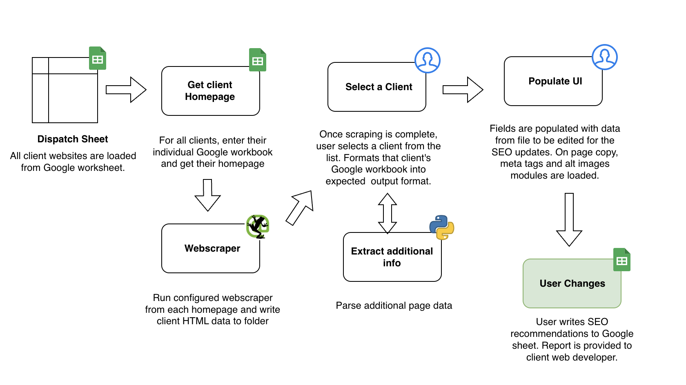
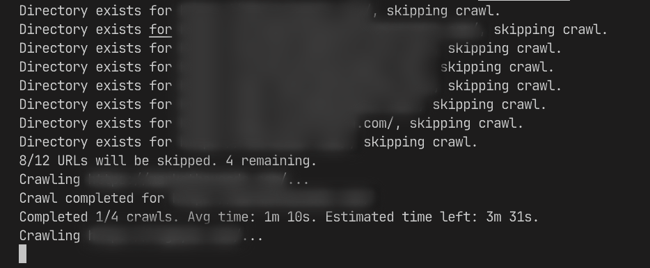
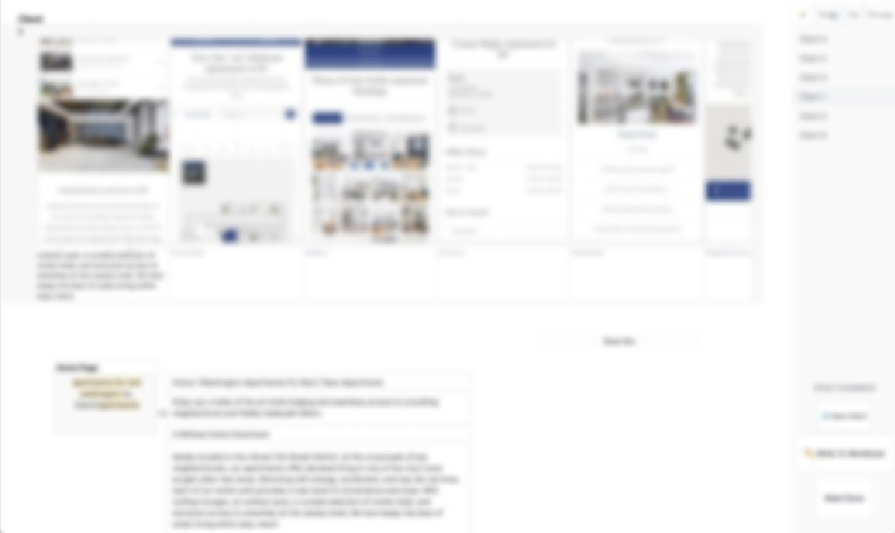
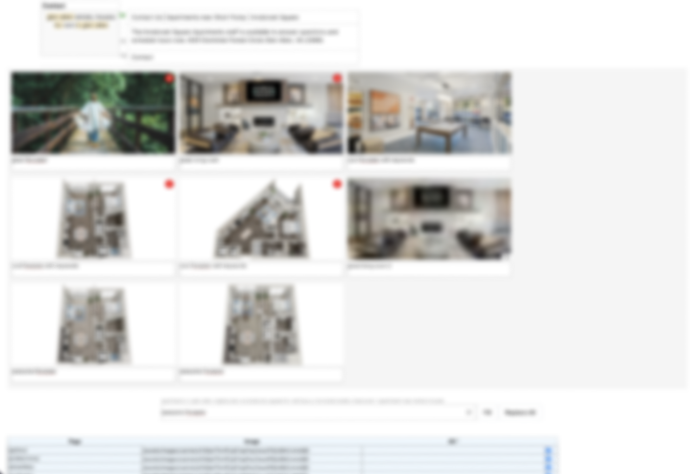
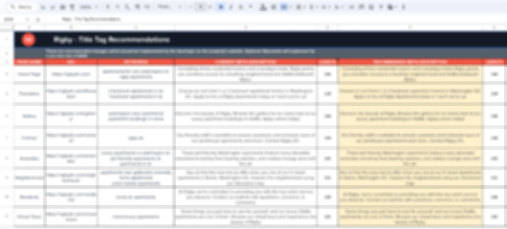

# SEO Content Refresher
Designed for a friend to speed up webscraping and data entry for SEO content writing.  
For monthly batches of ~100 client sites

## Data Flow

## Screenshot
Sorry these screenshots look a bit horrendous to maintain client anonymity.

Client websites are batch scraped.

Target meta data is displayed in a front end interface for editing.

Images can be selected for alt-tag editing.

Output to Google Sheets for delivery to client
